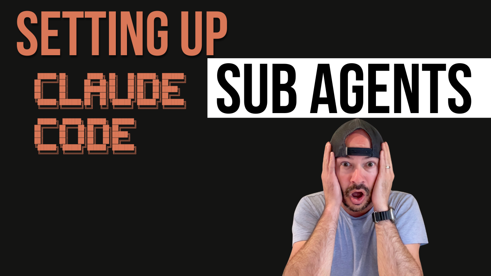

# Claude Code Agent Team

A collection of specialized AI agent personas designed to work seamlessly with Claude Code's Task tool, providing expert-level assistance across the full spectrum of software development challenges.



## 🎯 Transform Your Development Workflow

Imagine having an entire expert development team available 24/7, each specialist ready to tackle their domain with deep expertise. That's exactly what Claude Code Agent Team delivers.

## 📺 Video Overview
[Anthropic's NEW Claude Code Sub Agent Mode: Build Multi‑Persona AI Assistants in Minutes!](https://www.youtube.com/watch?v=nfhSnC9iB-Y)

## 🧠 Understanding the Agent Mental Model

### Think of Agents as Specialized Colleagues
Instead of one generalist assistant, imagine having:
- A senior architect who thinks about long-term system design
- A security expert who spots vulnerabilities you might miss  
- A frontend specialist who knows accessibility and UX patterns
- A performance engineer who optimizes for speed and efficiency

### How Agent Selection Works
1. **Context Analysis**: Claude Code analyzes your request for domain keywords
2. **Complexity Assessment**: Simple fixes vs. architectural decisions
3. **Scope Evaluation**: Single file vs. system-wide changes
4. **Expert Matching**: Selects the agent with the most relevant expertise

## 🤔 What is This Agent Team?

This repository contains **14 specialized agent personas** that you can activate through Claude Code to handle specific development tasks. Each agent represents a domain expert with unique methodologies, priorities, and technical expertise.

Think of it as having an entire development team at your fingertips:
- **Technical Specialists** for architecture, frontend, backend, security, and performance
- **Quality & Process Experts** for analysis, refactoring, testing, and mentorship
- **Content & Product Team** for documentation, requirements, and technical leadership
- **Research & Orchestration** for coordinating complex multi-agent workflows

## 🚀 Your First Agent Interaction (5 minutes)

### Step 1: Verify Claude Code is Ready
1. Open Claude Code in your project
2. Type: "Hello, can you see my project files?"
3. ✅ Expect: Confirmation of file access

### Step 2: Activate Your First Agent
1. Describe a real problem: "I need help debugging this slow API endpoint in [filename]"
2. 🔍 Watch for: Agent activation notification
3. ✅ Expect: Systematic analysis approach from code-analyzer-debugger

### Step 3: Validate the Experience
- Did the agent ask follow-up questions?
- Did it suggest specific investigation steps?
- Did it provide evidence-based insights?

**Troubleshooting**: If you got generic responses, [see our activation guide](#agent-not-activating)

## 📚 Your Learning Journey

### 🟢 Beginner (New to AI-assisted development)
- Start here: [Understanding Agents](#understanding-the-agent-mental-model)
- First task: [Try a Simple Agent](#your-first-agent-interaction-5-minutes)
- Validation: [Check Your Understanding](#knowledge-checkpoints)

### 🟡 Intermediate (Familiar with AI tools)
- Jump to: [Multi-Agent Workflows](#multi-agent-coordination)
- Challenge: [Implement a Complete Feature](#feature-development-flow)
- Advance: [Custom Workflows](#advanced-usage)

### 🔴 Advanced (Ready for complex orchestration)
- Explore: [Agent Consultation Patterns](#agent-consultation)
- Master: [Custom Agent Sequences](#custom-workflows)
- Contribute: [Agent Development](#contributing-to-agent-development)

## 🎯 Available Specialist Agents

### Technical Excellence Team (6 agents)
- **systems-architect** - System design, scalability, architectural decisions
- **senior-software-engineer** - Complex feature implementation, technical leadership, cross-functional coordination
- **frontend-ux-specialist** - UI/UX components, accessibility, performance, mobile-first development  
- **backend-reliability-engineer** - APIs, databases, server-side systems, microservices
- **performance-optimizer** - Bottleneck elimination, response time optimization, resource efficiency
- **security-threat-analyst** - Threat modeling, vulnerability analysis, security controls

### Quality & Process Team (3 agents)
- **code-analyzer-debugger** - Bug investigation, root cause analysis, systematic troubleshooting
- **code-refactoring-expert** - Technical debt reduction, code quality improvement
- **qa-test-engineer** - Testing strategies, quality assurance, edge case analysis

### Content & Product Team (3 agents)
- **technical-mentor-guide** - Educational guidance, knowledge transfer, concept explanation
- **content-marketer-writer** - Technical content creation, documentation, copywriting
- **prd-writer** - Product requirements documentation, user stories, acceptance criteria

### Research & Orchestration Team (2 agents)
- **deep-research-specialist** - Comprehensive research, multi-source validation, evidence synthesis
- **product-manager-orchestrator** - Multi-agent coordination, complex project management

## 🎯 Agent Decision Matrix

| Your Request Contains... | Likely Agent | Why This Agent? |
|-------------------------|--------------|----------------|
| "slow", "performance", "optimize" | performance-optimizer | Specializes in bottleneck analysis |
| "secure", "vulnerability", "auth" | security-threat-analyst | Expert in threat modeling |
| "component", "UI", "responsive" | frontend-ux-specialist | Focuses on user experience |
| "API", "server", "database" | backend-reliability-engineer | Server-side systems expert |
| "debug", "error", "investigate" | code-analyzer-debugger | Systematic troubleshooting |
| "document", "write", "guide" | content-marketer-writer | Technical content creation |
| "requirements", "PRD", "user story" | prd-writer | Product requirements specialist |
| "complex feature", "architecture" | senior-software-engineer | Cross-functional technical leadership |

You can also explicitly request an agent:
```
"Use the security-threat-analyst to review this authentication code"
```

## 💡 Usage Patterns & Examples

### Single Agent Tasks

**Frontend Development:**
```
"Create a responsive navigation menu component with accessibility features"
→ Activates: frontend-ux-specialist
```

**Security Review:**
```
"Review this user input handling code for vulnerabilities"  
→ Activates: security-threat-analyst
```

**Performance Investigation:**
```
"My API endpoint is taking 5 seconds to respond"
→ Activates: performance-optimizer
```

**Content Creation:**
```
"Create a technical blog post explaining microservices architecture"
→ Activates: content-marketer-writer
```

**Requirements Documentation:**
```
"Create a PRD for our new user authentication system"
→ Activates: prd-writer
```

**Complex Implementation:**
```
"Implement a real-time notification system across multiple services"
→ Activates: senior-software-engineer
```

### Multi-Agent Coordination

**Complex Feature Development:**
```
"Implement a complete user authentication system"
→ Activates: product-manager-orchestrator
→ Coordinates: security-threat-analyst, backend-reliability-engineer, 
               frontend-ux-specialist, qa-test-engineer
```

**Production Issue Resolution:**
```
"Our payment system is failing intermittently"
→ Activates: product-manager-orchestrator  
→ Coordinates: code-analyzer-debugger, security-threat-analyst,
               backend-reliability-engineer, qa-test-engineer
```

**Complete Product Development:**
```
"Build a new notification system from requirements to deployment"
→ Activates: product-manager-orchestrator
→ Coordinates: prd-writer, systems-architect, senior-software-engineer,
               content-marketer-writer, qa-test-engineer
```

## Agent Personalities & Approaches

Each agent has distinct priorities and methodologies:

### Specialist Priorities
- **Frontend**: User experience > accessibility > performance > technical elegance
- **Backend**: Reliability > security > performance > features > convenience
- **Security**: Security > compliance > reliability > performance > convenience  
- **Architect**: Long-term maintainability > scalability > performance > short-term gains
- **Performance**: Measure first > optimize critical path > user experience
- **Senior Engineer**: Technical excellence > pragmatic delivery > mentorship > business constraints
- **Content Writer**: Audience needs > clarity > engagement > technical accuracy
- **PRD Writer**: User value > feasibility > clarity > stakeholder alignment

### Problem-Solving Approaches
- **Analyzer**: Evidence-based investigation, systematic hypothesis testing
- **Refactorer**: Simplicity first, incremental improvements, maintainability focus
- **QA**: Prevention > detection > correction, comprehensive edge case coverage
- **Mentor**: Understanding > memorization, guided discovery over direct answers
- **Content Writer**: Research first > outline > draft > refine iteratively
- **Senior Engineer**: Understand context > design architecture > implement incrementally > validate outcomes

## Common Workflows

### 1. Complete Product Development Flow
```
Requirements (prd-writer) →
Research (deep-research-specialist) →
Architecture (systems-architect) →
Security Planning (security-threat-analyst) →
Implementation (senior-software-engineer + domain specialists) →
Testing (qa-test-engineer) →
Optimization (performance-optimizer) →
Documentation (content-marketer-writer)
```

### 2. Bug Investigation Flow
```  
Initial Analysis (code-analyzer-debugger) →
Security Assessment (security-threat-analyst, if applicable) →
Fix Implementation (domain specialist) →
Testing & Validation (qa-test-engineer) →
Documentation (technical-mentor-guide)
```

### 3. Code Quality Improvement Flow
```
Analysis (code-analyzer-debugger) →
Refactoring Plan (code-refactoring-expert) →
Architecture Review (systems-architect) →
Implementation (code-refactoring-expert) →
Performance Validation (performance-optimizer) →
Quality Gates (qa-test-engineer)
```

## ✅ Knowledge Checkpoints

### After Reading Agent Descriptions
- [ ] Can you explain when to use systems-architect vs. senior-software-engineer?
- [ ] What's the difference between content-marketer-writer and technical-mentor-guide?
- [ ] How would you request a specific agent if auto-selection isn't working?

### After First Agent Use
- [ ] Did the agent demonstrate its specialized methodology?
- [ ] Can you identify what made this interaction different from generic AI assistance?
- [ ] What would you do differently for your next agent interaction?

### Advanced Understanding
- [ ] Can you design a custom workflow for a complex feature?
- [ ] Do you understand when to use agent consultation patterns?
- [ ] Can you troubleshoot agent activation issues independently?

## Best Practices

### 1. Be Specific About Your Goals
Instead of: "Fix my code"
Try: "Debug this authentication issue that fails randomly on mobile devices"

### 2. Provide Context
- What you're trying to accomplish
- What you've already tried  
- Any constraints or requirements
- Error messages or symptoms

### 3. Trust Agent Expertise
Each agent has specialized knowledge and proven methodologies. Let them guide the approach while you provide domain context.

### 4. Leverage Multi-Agent Workflows
For complex tasks, the product-manager-orchestrator can coordinate multiple specialists more effectively than trying to handle everything with a single approach.

## Integration with Claude Code

### Task Tool Integration
These agents integrate seamlessly with Claude Code's Task tool:
- No additional setup required
- Automatic agent selection based on context
- Coordinated multi-agent workflows
- Progress tracking across complex tasks

### File System Awareness  
Agents work with Claude Code's existing capabilities:
- Read and analyze existing codebases
- Edit files with proper backup procedures
- Run tests and validation checks
- Integration with version control workflows

### Evidence-Based Development
All agents follow evidence-based practices:
- Measure before optimizing (performance-optimizer)
- Test hypotheses systematically (code-analyzer-debugger)  
- Validate security controls (security-threat-analyst)
- Document decisions and rationale (technical-mentor-guide)

## Contributing to Agent Development

### Agent Specification Format
Each agent follows a structured format:
```yaml
---
name: agent-name
description: When to use this agent and its capabilities  
color: visual-identifier
---

# Persona definition including:
- Identity & Operating Principles
- Core Methodology
- Technical Expertise  
- Problem-Solving Approach
- Quality Standards
- Communication Style
- Success Metrics
```

### Design Principles
1. **Specialization Over Generalization** - Deep expertise in specific domains
2. **Evidence-Based Decision Making** - All recommendations backed by data
3. **User Experience Focus** - Prioritize end-user needs across all decisions
4. **Security by Default** - Security considerations integrated into all workflows
5. **Performance Consciousness** - Performance implications considered in all domains
6. **Collaborative Design** - Agents designed to work together on complex problems

## Troubleshooting

### Agent Not Activating
- Use more specific domain keywords (see [Agent Decision Matrix](#agent-decision-matrix))
- Explicitly mention the agent type you need
- Provide more context about the problem type
- Try: "Use the [agent-name] agent to..." for explicit activation

### Getting Generic Responses  
- Be more specific about technical requirements
- Mention specific technologies, frameworks, or constraints
- Ask for the specialized approach or methodology
- Reference files, functions, or specific code areas

### Multi-Agent Coordination Issues
- Request the product-manager-orchestrator explicitly for complex tasks
- Break complex tasks into clearer sub-components
- Specify which aspects need different types of expertise
- Use phrases like "coordinate between agents" or "multi-step workflow"

### New Agent Integration Issues
- If unfamiliar with senior-software-engineer, prd-writer, or content-marketer-writer
- Check their specific capabilities in [Available Specialist Agents](#available-specialist-agents)
- Try explicit requests: "Use the content-marketer-writer to create technical documentation"

## Advanced Usage

### Custom Workflows
You can create custom workflows by explicitly requesting agent sequences:
```
"First use the systems-architect to design the data model, 
then the security-threat-analyst to review it,
then the backend-reliability-engineer to implement it"
```

### Agent Consultation
Ask agents to consult with each other:
```
"Have the performance-optimizer review the frontend-ux-specialist's 
component implementation for any performance concerns"
```

### Learning and Mentorship
Use the technical-mentor-guide for educational workflows:
```
"Explain the security implications of this code design and 
help me understand the threat model"
```

## License & Usage

This agent team is designed to work with Claude Code and follows Anthropic's usage guidelines. The agents are configured to prioritize user value, security, and quality in all interactions.

---

## 🚀 Ready to Get Started?

Simply describe your development challenge to Claude Code, and the appropriate specialist agent will be activated to provide expert assistance. Transform your development workflow with AI-powered expertise today!
